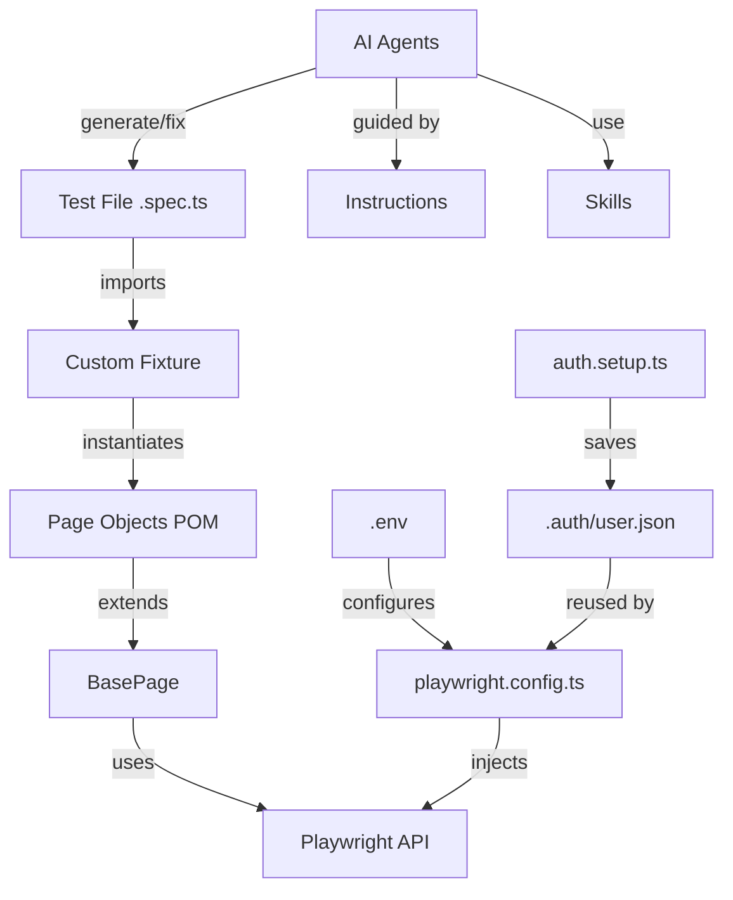

# 🤖 AI-Powered E2E Playwright Framework — PRAGMA

[](https://github.com/Sebasg96/ai-e2e-playwright-pragma/actions/workflows/playwright-tests.yml)
[](https://www.typescriptlang.org/)
[](https://playwright.dev/)
[](LICENSE)

> End-to-End testing framework for the **PRAGMA** platform, powered by AI agents and skills from [fugazi/test-automation-skills-agents](https://github.com/fugazi/test-automation-skills-agents).

---

## 📁 Project Structure

```
.
├── .github/
│   ├── agents/                   # AI agent definitions (Copilot / Claude / Cursor)
│   │   ├── playwright-test-planner.agent.md
│   │   ├── playwright-test-generator.agent.md
│   │   ├── playwright-test-healer.agent.md
│   │   └── flaky-test-hunter.agent.md
│   ├── instructions/             # Coding standards for AI assistants
│   │   ├── playwright-typescript.instructions.md
│   │   └── a11y.instructions.md
│   ├── skills/                   # Reusable AI playbooks
│   │   └── playwright-e2e-testing/SKILL.md
│   └── workflows/
│       └── playwright-tests.yml  # CI/CD pipeline
│
├── src/
│   ├── pages/                    # Page Object Model (POM) classes
│   │   ├── BasePage.ts           # Abstract base with shared utilities
│   │   ├── LoginPage.ts          # Authentication flows
│   │   └── DashboardPage.ts      # Main dashboard navigation
│   ├── fixtures/
│   │   └── base.fixture.ts       # Custom Playwright fixtures
│   ├── helpers/
│   │   └── env.helper.ts         # Typed environment config loader
│   └── data/
│       └── users.json            # Test user definitions per role
│
├── tests/
│   ├── auth.setup.ts             # Global auth setup (runs once, saves session)
│   ├── smoke/                    # 🚀 Tier 0 — Critical path, every commit
│   │   └── login.spec.ts
│   ├── sanity/                   # ✅ Tier 1 — Core features, every PR
│   │   └── navigation.spec.ts
│   ├── regression/               # 🔄 Tier 2/3 — Full coverage, nightly
│   └── a11y/                     # ♿ Accessibility — WCAG 2.1 AA
│
├── docs/                         # Documentation
├── playwright.config.ts          # Playwright configuration
├── tsconfig.json                 # TypeScript configuration
└── package.json
```

---

## 🚀 Quick Start

### Prerequisites
- Node.js ≥ 20
- A running PRAGMA instance (local or staging)

### 1. Clone & Install
```bash
git clone https://github.com/Sebasg96/ai-e2e-playwright-pragma.git
cd ai-e2e-playwright-pragma
npm install
npx playwright install chromium
```

### 2. Configure Environment
```bash
cp .env.example .env
# Edit .env with your BASE_URL and test credentials
```

### 3. Run Tests
```bash
# Smoke tests (fastest — critical path)
npm run test:smoke

# Sanity tests (core features)
npm run test:sanity

# All tests
npm test

# Interactive UI mode
npm run test:ui

# Open HTML report
npm run report
```

---

## 🤖 AI Integration

This project integrates AI agents and skills that guide AI coding assistants (GitHub Copilot, Claude, Cursor) to write high-quality tests automatically.

### Agents

| Agent | Use When |
|---|---|
| `playwright-test-planner` | Exploring PRAGMA and generating a test plan |
| `playwright-test-generator` | Creating Playwright tests from a plan |
| `playwright-test-healer` | Debugging and fixing failing tests |
| `flaky-test-hunter` | Investigating intermittent test failures |

### Suggested Workflows

**Workflow 1 — From requirements to tests:**
1. Use `@playwright-test-planner` to explore PRAGMA and create a test plan
2. Use `@playwright-test-generator` to generate tests from the plan
3. Use `@playwright-test-healer` to fix any failures

**Workflow 2 — Stabilize a flaky suite:**
1. Use `@flaky-test-hunter` to identify root causes
2. Apply fixes (wait strategy, locator updates)
3. Re-run to verify stability

---

## 🏗 Architecture



---

## 🧪 Test Tiering Strategy

| Tier | Tag | Scope | Trigger | Target |
|---|---|---|---|---|
| 0 — Smoke | `@smoke` | Critical path | Every commit | < 2 min |
| 1 — Sanity | `@sanity` | Core features | Every PR | < 10 min |
| 2 — Regression | `@regression` | All features | On merge | < 30 min |
| 3 — Full | — | All browsers | Nightly | < 60 min |
| A11y | `@a11y` | Accessibility | PR + Nightly | — |

---

## 📖 Documentation

- [Test Strategy](docs/TEST_STRATEGY.md)
- [Architecture Guide](docs/ARCHITECTURE.md)
- [Contributing Guide](CONTRIBUTING.md)

---

## 🛠 Tech Stack

| Tool | Version | Purpose |
|---|---|---|
| [Playwright](https://playwright.dev/) | 1.52 | Browser automation |
| [TypeScript](https://typescriptlang.org/) | 5.7 | Type-safe test code |
| [Allure](https://allurereport.org/) | 3.x | Test reporting |
| [GitHub Actions](https://docs.github.com/en/actions) | — | CI/CD pipeline |

---

## 👤 Author

**Sebastian Gomez** — [@Sebasg96](https://github.com/Sebasg96)

QA Automation Engineer | AI-augmented testing  
*Built as part of QA portfolio showcasing AI-powered E2E testing practices.*

---

## 📄 License

MIT © Sebastian Gomez
